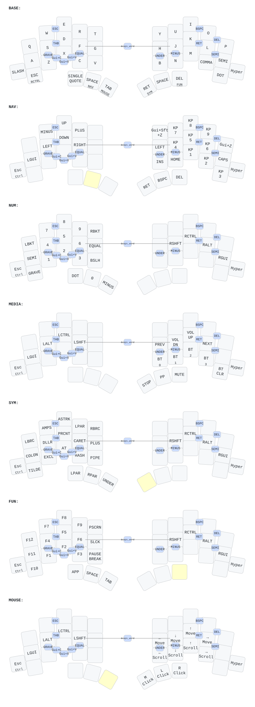

# TOTEM — ZMK Firmware Config

[](../../actions/workflows/build.yml)

> Custom ZMK configuration for the [TOTEM](https://github.com/GEIGEIGEIST/TOTEM) 38-key split keyboard. Features a clean QWERTY base, dedicated thumb modifiers, navigation & numeric keypad layers, symbol & function layers, media & mouse emulation, comprehensive combos, macros, real-time [ZMK Studio](https://zmk.studio/) support, and [Keymap Editor](https://nickcoutsos.github.io/keymap-editor/) integration.

> [!IMPORTANT]
> **After Flashing: Restore Stock Settings in ZMK Studio!**  
> When you flash a new firmware onto your keyboard, ZMK automatically loads any existing custom layout saved in the controller's internal flash memory (NVS / Non-Volatile Storage). To ensure your keyboard loads the newly compiled firmware layout without stale overrides:
> 1. Plug in your **left half** via USB.
> 2. Open **[zmk.studio](https://zmk.studio/)** in a WebUSB-compatible browser (Chrome, Edge, or Brave) and click **Connect**.
> 3. Click **"Reset Keymap" / "Restore Defaults"** (or discard changes). This clears previous NVS overrides so the keyboard immediately runs the exact keymap compiled in firmware.

> [!TIP]
> **Easily Edit This Keymap Online!**  
> Use Nick Coutsos' **[Keymap Editor](https://nickcoutsos.github.io/keymap-editor/)** to visually edit and customize this keymap directly in your browser. With our built-in `config/info.json` layout metadata, your visual edits commit straight back to your GitHub repo and map **100% accurately** onto your TOTEM keyboard without any key shifting.

---

## Keymap



*Auto-generated with [keymap-drawer](https://github.com/caksoylar/keymap-drawer) on every push.*

---

## Layout Overview

This configuration is designed for maximum typing speed and ergonomics on a 38-key split columnar keyboard:

- **QWERTY base** with dedicated thumb modifiers and outer pinky keys (no home row mod-taps to prevent misfires during fast typing).
- **Navigation & Numpad layer (NAVNUM)** accessible on right middle thumb hold.
- **Symbol & Function layer (SYMFN)** accessible on left middle thumb hold.
- **Media & Bluetooth layer (MEDIA)** accessible via dual-thumb combo (`Left Thumb 2 + Right Thumb 2`).
- **Mouse emulation layer (MOUSE)** accessible via inner dual-thumb combo (`Left Thumb 3 + Right Thumb 1`).
- **Rich combo suite** for one-handed shortcuts (Copy/Paste/Cut, Tab, Enter, Equal, Plus, Minus, Search, Tilde, Caps Word).
- **Custom macros** for macOS Hyper key (`Cmd+Alt+Ctrl+Shift`) and degree symbol (`°`).

### Thumb & Outer Keys

```
Left Hand                                                Right Hand
┌───────────┐ ┌──────────┬───────────┬────────────┐ ┌─────────┬───────────┬─────────────┐ ┌─────────┐
│ Esc / Ctrl│ │Backspace │ Tab /     │ Left Shift │ │ Space   │ Tab /     │ Del /       │ │    '    │
│ (Outer)   │ │/ Left Cmd│ SYMFN     │            │ │         │ NAVNUM    │ Right Alt   │ │ (Outer) │
└───────────┘ └──────────┴───────────┴────────────┘ └─────────┴───────────┴─────────────┘ └─────────┘
```

| Key Position | Tap | Hold | Purpose / Notes |
|:---|:---|:---|:---|
| **Left Outer Pinky** | `Escape` | `Right Ctrl` | Quick Vim escape + Ctrl modifier |
| **Left Thumb 1 (Outer)** | `Backspace` | `Left Command` | Efficient backspacing and macOS Command modifier |
| **Left Thumb 2 (Middle)** | `Tab` | `SYMFN` (Layer 1) | Instant access to symbols and F1–F12 |
| **Left Thumb 3 (Inner)** | `Left Shift` | `Left Shift` | Dedicated shift key |
| **Right Thumb 1 (Inner)** | `Space` | `Space` | Primary spacebar |
| **Right Thumb 2 (Middle)** | `Tab` | `NAVNUM` (Layer 2) | Instant access to navigation arrows and numpad |
| **Right Thumb 3 (Outer)** | `Delete` | `Right Alt` | Forward delete and Option/Alt modifier |
| **Right Outer Pinky** | `'` (Single Quote) | — | Standard quote / apostrophe |

---

## Layers

### 0. BASE
Standard QWERTY layout with dedicated modifiers located on the thumb cluster and outer pinky keys for maximum typing speed without mod-tap misfires on alpha keys.

### 1. SYMFN (Symbol & Function)
*Activated by holding Left Thumb 2 (`Tab` / Layer 1).*
- **Left Hand:** Symbols (`|`, `@`, `#`, `$`, `%`), Spanish punctuation (`¡` via `Alt+1`, `¿` via `AltGr+?`), paired brackets (`(`, `{`, `[`), and function keys (`F1` outer pinky, `F2`–`F6`).
- **Right Hand:** Symbols (`^`, `&`, `*`, `Backspace`, `Delete`), paired brackets (`]`, `}`, `)`), punctuation (`?`, `!`), and function keys (`F7`–`F11`, `F12` outer pinky).
- **Thumb Modifiers:** Right hand provides `Space`, `Right Alt`, and `Right Command`.

### 2. NAVNUM (Navigation & Numpad)
*Activated by holding Right Thumb 2 (`Tab` / Layer 2).*
- **Left Hand Navigation:** `Tab`, `Home`, `Up`, `End`, `Redo`, `CapsLock`, `Left`, `Down`, `Right`, `Undo`, `Insert`, `Page Down`, `Cmd+Down`, `Page Up`, `Enter`.
- **Left Hand Thumb Modifiers:** `Left Alt`, `Left GUI (Cmd)`, and `Sticky Left Shift`. Left outer key acts as `Esc / Left Ctrl`.
- **Right Hand Numpad:** Dedicated 10-key numpad (`0`–`9`), decimal dot (`.`), comma (`,`), arithmetic operators (`+`, `-`, `*`), and right outer key mapped to `Hyper`.

### 3. MEDIA & Bluetooth
*Activated via dual-thumb combo (`Left Thumb 2 + Right Thumb 2`): Hold for MEDIA layer, Tap for Right Alt.*
- **App Launchers:** Messages (`C_AL_INSTANT_MESSAGING`), Calculator (`C_AL_CALC`), Calendar (`C_AL_CALENDAR`).
- **Media Controls:** Stop, Previous, Play/Pause, Next.
- **Volume & Screen:** Volume Up, Volume Down, Mute, Brightness Up, Brightness Down.
- **Bluetooth Management:** Select profiles 0–3 (`BT_SEL 0` to `BT_SEL 3`) on bottom row, clear profile (`BT_CLR`) on right outer pinky.

### 4. MOUSE
*Activated via inner dual-thumb combo (`Left Thumb 3 + Right Thumb 1`): Hold for MOUSE layer, Tap for Left Alt.*
- **Mouse Movement:** `mmv MOVE_UP`, `mmv MOVE_DOWN`, `mmv MOVE_LEFT`, `mmv MOVE_RIGHT` with accelerated steps (`MOVE_X(±300)`, `MOVE_Y(±300)`).
- **Scrolling:** `msc SCRL_UP`, `msc SCRL_DOWN`, `msc SCRL_LEFT`, `msc SCRL_RIGHT`.
- **Mouse Buttons:** Left Click (`mkp LCLK`), Right Click (`mkp RCLK`), and Middle Click (`mkp MCLK`).

---

## Combos

All combos are configured with idle timeouts and prior-idle requirements to ensure they never accidentally trigger during fast typing.

| Combo | Physical Keys | Key Positions | Output / Action | Purpose / Description |
|:---|:---|:---|:---|:---|
| **Tab** | `Q + W` | `0 + 1` | `Tab` | Quick one-handed Tab |
| **Caps Word** | `A + S` | `10 + 11` | `&caps_word` | Smart Caps Word toggle |
| **Quick Search** | `S + D + F` | `11 + 12 + 13` | `C_AC_SEARCH` | macOS Spotlight / App Search |
| **Equal (`=`)** | `I + O` | `7 + 8` | `=` | Quick equal sign |
| **Plus (`+`)** | `O + P` | `8 + 9` | `+` | Quick plus sign |
| **Enter** | `J + K + L` | `16 + 17 + 18` | `Enter` | Right home-row Enter |
| **Minus (`-`)** | `L + ;` | `18 + 19` | `-` | Quick minus / underscore |
| **Tilde (`~`)** | `J + N` | `16 + 25` | `~` | Vertical index tilde |
| **Cut** | `Z + X` | `20 + 21` | `Cmd + X` | Bottom row cut shortcut |
| **Copy** | `Z + C` | `20 + 22` | `Cmd + C` | Bottom row copy shortcut |
| **Paste** | `Z + V` | `20 + 23` | `Cmd + V` | Bottom row paste shortcut |
| **Media Layer** | `L-Thumb 2 + R-Thumb 2` | `32 + 35` | `&lt MEDIA RIGHT_ALT` | Hold for Media/BT layer, Tap for Right Alt |
| **Mouse Layer** | `L-Thumb 3 + R-Thumb 1` | `33 + 34` | `&lt MOUSE LEFT_ALT` | Hold for Mouse layer, Tap for Left Alt |

---

## Custom Macros

- **`&hyper`**: Macro that presses `LGUI + LALT + LCTRL + LSHFT`. Perfect for application launcher and window management shortcuts (Raycast, Alfred, Rectangle, Aerospace) without shortcut collisions.
- **`&degree`**: Macro for macOS degree symbol `°` (`Shift + Option + 8`).

---

## Behavior Tuning

```dts
&mt {
    flavor = "tap-preferred";
    tapping-term-ms = <200>;
    quick-tap-ms = <175>;
    require-prior-idle-ms = <150>;
};

&lt {
    flavor = "balanced";
    tapping-term-ms = <200>;
    quick-tap-ms = <175>;
};
```

- **Mod-Tap (`&mt`):** `tap-preferred` flavor ensures quick tapping of thumbs and outer keys registers immediately as the tap key, with a 150 ms prior-idle guard to prevent accidental holds.
- **Layer-Tap (`&lt`):** `balanced` flavor enables responsive layer transitions when holding layer-tap thumbs.

---

## Hardware

| Component | Details |
|:---|:---|
| **Keyboard** | [TOTEM](https://github.com/GEIGEIGEIST/TOTEM) — 38-key columnar stagger split |
| **MCU** | Seeed Studio XIAO BLE (nRF52840) |
| **Firmware** | [ZMK Firmware](https://zmk.dev/) (Zephyr 4.1, main branch) |
| **Features** | ZMK Studio, Keymap Editor integration, Mouse keys, Bluetooth 5.0 |

---

## Keymap Editors

### 1. Keymap Editor (by Nick Coutsos)

This repository includes a custom `config/info.json` metadata file specifically formatted for [Keymap Editor by Nick Coutsos](https://nickcoutsos.github.io/keymap-editor/).

- **1:1 Visual Alignment:** Accurately maps the 38 TOTEM keys (including outer pinkies and thumb clusters) with correct physical coordinates.
- **GitHub Integration:** Authorize Keymap Editor to edit your keymap graphically in your browser; changes commit directly back to GitHub.
- **Matrix Formatting:** Includes full `row` and `col` properties for clean `.keymap` matrix generation.

### 2. ZMK Studio

[ZMK Studio](https://zmk.studio/) allows you to edit your keymap in real time over WebUSB — no reflashing or code commits required.

#### How to Connect

1. **Plug in the left half** via USB (Studio RPC is enabled on the left half).
2. Open [zmk.studio](https://zmk.studio/) in a WebUSB-compatible browser (Chrome, Edge, Brave).
3. Click **Connect** and select your TOTEM device.
4. Edit your keymap in real time!

#### Build Configuration

Studio support is configured in `build.yaml` for the left half:

```yaml
- board: xiao_ble//zmk
  shield: totem_left
  snippet: studio-rpc-usb-uart
  cmake-args: -DCONFIG_ZMK_STUDIO=y -DCONFIG_ZMK_STUDIO_LOCKING=n
```

- `CONFIG_ZMK_STUDIO=y` — enables the Studio RPC endpoint.
- `CONFIG_ZMK_STUDIO_LOCKING=n` — disables security lock for frictionless editing.
- `snippet: studio-rpc-usb-uart` — routes Studio communication over USB serial.

---

## Firmware Configuration

Key settings in `config/totem.conf`:

| Setting | Value | Purpose |
|:---|:---|:---|
| `CONFIG_ZMK_MOUSE` | `y` | Enable mouse key emulation (movement, scroll, click) |
| `CONFIG_ZMK_USB_LOGGING` | `n` | Disable USB logging for production performance |

---

## Getting the Firmware

Firmware builds automatically via GitHub Actions on every push.

1. Go to the [Actions](../../actions) tab in your GitHub repository.
2. Open the latest successful **Build ZMK firmware** run.
3. Download the `totem_left` and `totem_right` artifacts (`.uf2` files).

### Flashing

1. Double-tap the reset button on the XIAO BLE controller to enter bootloader mode.
2. A USB storage volume will appear (e.g. `XIAO-BLE`). Drag the corresponding `.uf2` file onto it.
3. Flash the **left half first** (`totem_left`), then the **right half** (`totem_right`).
4. **Important:** After flashing, open [zmk.studio](https://zmk.studio/) and click **"Reset Keymap"** to ensure previous NVS overrides are cleared.

---

## Repository Structure

```
├── config/
│   ├── totem.keymap        # Keymap definition (layers, combos, macros, behaviors)
│   ├── totem.conf          # Firmware features (mouse keys, logging)
│   ├── info.json           # Keymap Editor (Nick Coutsos) physical layout mapping
│   └── west.yml            # ZMK module manifest (main branch)
├── boards/shields/totem/   # Board shield definition (matrix, pins, layout)
├── keymap-drawer/          # Auto-generated keymap diagrams
│   ├── config.yaml         # Diagram styling + mouse key labels
│   ├── totem.yaml          # Parsed keymap data
│   └── totem.svg           # Visual keymap diagram
├── build.yaml              # GitHub Actions build matrix (ZMK Studio config)
└── .github/workflows/
    ├── build.yml           # Firmware build workflow
    └── draw-keymaps.yml    # Keymap diagram generator workflow
```

---

## Credits

- [TOTEM Keyboard](https://github.com/GEIGEIGEIST/TOTEM) by GEIGEIGEIST
- [ZMK Firmware](https://zmk.dev/)
- [Keymap Editor](https://github.com/nickcoutsos/keymap-editor) by Nick Coutsos
- [keymap-drawer](https://github.com/caksoylar/keymap-drawer) by caksoylar
- [urob/zmk-config](https://github.com/urob/zmk-config) — combo and behavior tuning reference
